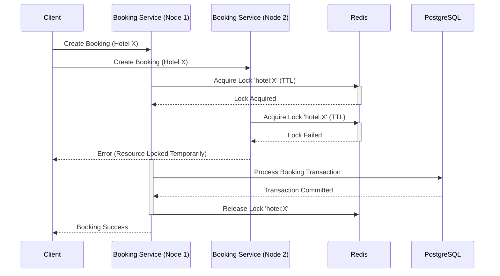
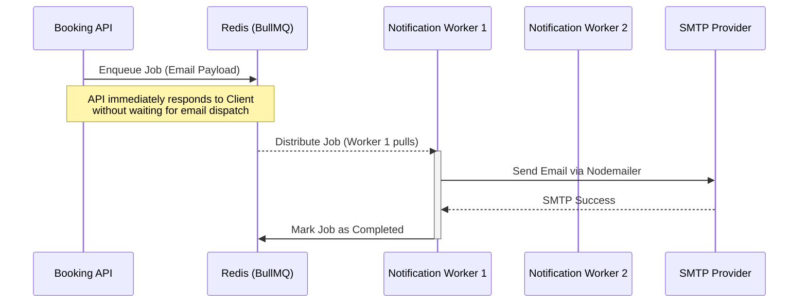

# Booking Backend Architecture

## Monorepo Root Structure
The repository is organized as a monorepo utilizing npm workspaces to manage dependencies and orchestrate scripts across multiple microservices. The root `package.json` defines the workspaces encompassing three core services: `hotel-service`, `booking-service`, and `notification-service`. This structure allows for centralized dependency management while keeping the codebases logically separated. The root directory also maintains shared configurations for code formatting tools like Prettier, ensuring consistency across all enclosed microservices. Scripts defined at the root level permit the execution of development servers for individual workspaces from a central location.

## Microservice Specifications

### 1. Hotel Service
**Specification:** This service is responsible for managing hotel and room inventories. It is built on Node.js using the Express framework. It utilizes Sequelize as its Object-Relational Mapper (ORM) to interface with a PostgreSQL database.
**Working and Approach:** The service exposes a RESTful API architecture. It processes requests related to hotel entities and room categories. Database migrations and model synchronization are handled through Sequelize-CLI. Data validation is strictly enforced using Zod schemas to ensure structural integrity of incoming payloads before they reach the controller layer. Application logging is managed by Winston, configured for daily log rotation. The folder structure follows a standard separation of concerns, dividing logic into controllers, routers, models, and repositories.

### 2. Booking Service
**Specification:** This service handles the core transactional logic of the application, managing reservation creation and confirmation. It operates on Node.js and Express, utilizing Prisma ORM to interact with the PostgreSQL database. It integrates Redis via `ioredis` and utilizes `redlock` for distributed locking mechanisms.
**Working and Approach:** The service intercepts incoming booking requests and interfaces with PostgreSQL for high-performance data manipulation. The architecture separates concerns into controllers for routing, services for business logic, and repositories for direct database access. Prisma's schema definition provides a strongly typed database client, which reduces runtime errors and streamlines query construction.

### 3. Notification Service
**Specification:** This service functions as an asynchronous worker system dedicated to handling outbound communications, primarily email dispatch. It relies on BullMQ backed by Redis for message queuing. Nodemailer is used for email delivery, coupled with Handlebars for compiling dynamic email templates.
**Working and Approach:** To prevent the core booking flows from being blocked by slow network operations, this service decouples notification logic from the main request lifecycle. It listens to Redis queues for incoming jobs (such as booking confirmations). Upon receiving a job, dedicated processors compile the required email template using Handlebars and dispatch the payload via Nodemailer.

---

## Core Architectural Concepts & Engineering Decisions

### Idempotency
To prevent unintended duplicate operations, specifically in scenarios where network instability might cause a client to retry a booking confirmation, the system implements idempotency keys.
**Approach:** During the initial creation of a booking, the service generates a unique idempotency key. This key is stored in PostgreSQL within a dedicated `IdempotencyKey` table and linked via a relation to the newly created booking record. When a client subsequently requests to confirm the booking, they must provide this key. The system verifies the state of the key in the database. If the key indicates that the operation has already been finalized, the system rejects the duplicate request. This guarantees that critical state changes occur exactly once.

### Distributed Locks for Maximum Isolation (Redlock)
To ensure maximum isolation during concurrent operations on shared resources, the booking system employs distributed locking via the Redlock algorithm using Redis.

**Approach:** Before a booking can be created, the system must guarantee that multiple concurrent requests do not attempt to book the same hotel resources simultaneously. When a request enters the booking service, it attempts to acquire a Redis lock on a specific resource identifier (e.g., `hotel:[hotelId]`) for a predefined Time-To-Live (TTL). 

#### Why Lock on Redis and not PostgreSQL?
While PostgreSQL supports row-level locking (`SELECT ... FOR UPDATE`), relying exclusively on database locks for initial concurrency control is inefficient at scale:
1. **Connection Pool Exhaustion:** Database locks require holding open a PostgreSQL connection for the duration of the transaction. Under high concurrency, this rapidly exhausts the database connection pool.
2. **Performance & I/O:** Redis is an in-memory data structure store. Acquiring a lock in Redis is an `O(1)` memory operation, magnitudes faster than a database I/O operation. 
3. **Early Rejection:** By checking the lock in Redis *before* starting a database transaction, we reject conflicting requests early (fail-fast), saving valuable database CPU and connection resources for actual durable writes. Redis acts as a high-speed gatekeeper for PostgreSQL.

### ACID Compliant Transactions
For operations requiring strict adherence to Atomicity, Consistency, Isolation, and Durability, the system utilizes database-level transactions combined with explicit row-level locking.
**Approach:** The booking confirmation process involves multiple critical database updates that must either succeed completely or fail entirely. The service executes these operations within a Prisma `$transaction` block. To handle isolation at the database level, the transaction executes a raw SQL query: `SELECT * FROM IdempotencyKey WHERE key=${key} FOR UPDATE`. This instructs PostgreSQL to place an exclusive lock on the specific row retrieved. Any concurrent transaction attempting to read or modify this row is forced to wait until the current transaction completes, ensuring complete data integrity upon commit or rollback.

### Caching Strategy (Write-Around Cache)
The presence of Redis in the architecture naturally supports a **Write-Around Cache** pattern for read-heavy operations, such as viewing hotel availability and room details. 
**Approach:** In a write-around cache, write operations (like updating a room's configuration) are committed directly to PostgreSQL. Read operations first check Redis. On a cache miss, the data is fetched from PostgreSQL and then populated into Redis. Given that hotel data is read frequently but updated infrequently, this pattern minimizes cache invalidation complexity while offloading massive read pressure from the primary PostgreSQL database, drastically improving API response times.

### Asynchronous Event Delegation (Notification Queue)
To maintain a fast and responsive user experience, the system delegates non-critical operations, such as sending emails, to an asynchronous queue using BullMQ and Redis.

**Approach:** When a booking is confirmed, the Booking Service does not synchronously wait for the email provider to send the confirmation. Instead, it pushes a job payload to a Redis queue and immediately returns a success response to the client. The Notification Service continuously polls this queue, processes the jobs, compiles the templates, and handles the actual email dispatch. This guarantees that temporary outages in the email provider do not break the core booking flow.

### System Scale and Horizontal Scalability
This architecture is engineered to handle enterprise-level scale and high-concurrency traffic spikes (e.g., holiday seasons or flash sales). 

- **Independent Scaling:** Because the system is decomposed into microservices, each component can be scaled horizontally independent of the others. If the system experiences a backlog of emails, you can spin up additional `notification-service` containers without paying for extra `hotel-service` resources.
- **Stateless Application Layer:** The Node.js services (Booking, Hotel, Notification) are entirely stateless. State is managed exclusively by PostgreSQL (persistent data) and Redis (locks, queues, cache). This allows you to deploy multiple instances of any service behind a load balancer, providing high availability and fault tolerance.
- **Traffic Orchestration:** Redis acts as the central nervous system for this horizontal scaling, coordinating locks across multiple booking instances to ensure that no matter which physical server processes a request, race conditions are mitigated, and database integrity is preserved.
