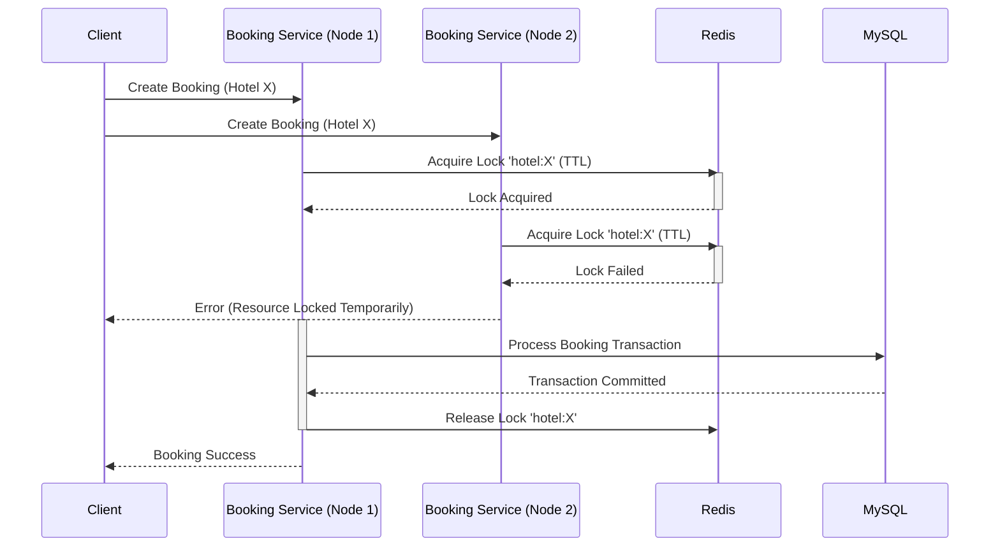
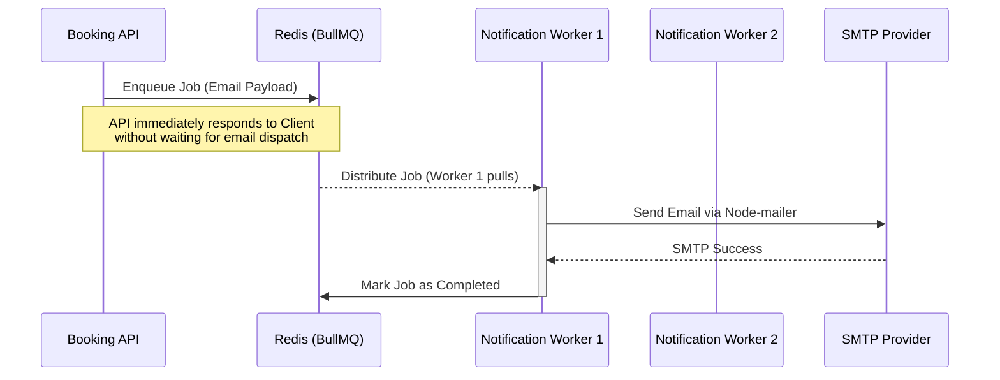

# Booking Backend Architecture

## Monorepo Root Structure
The repository is organized as a monorepo utilizing npm workspaces to manage dependencies and orchestrate scripts across multiple microservices. The root `package.json` defines the workspaces encompassing three core services: `hotel-service`, `booking-service`, and `notification-service`. This structure allows for centralized dependency management while keeping the codebases logically separated. The root directory also maintains shared configurations for code formatting tools like Prettier, ensuring consistency across all enclosed microservices. Scripts defined at the root level permit the execution of development servers for individual workspaces from a central location.

## Microservice Specifications

### 1. Hotel Service
**Specification:** This service is responsible for managing hotel and room inventories. It is built on Node.js and TypeScript using the Express framework. It utilizes Sequelize ORM to interface with a MySQL database.
**Working and Approach:** The service exposes a RESTful API architecture. It processes requests related to hotel entities and room categories. Database migrations and model synchronization are handled through Sequelize-CLI. Data validation is strictly enforced using Zod schemas to ensure structural integrity of incoming payloads before they reach the controller layer. Application logging is managed by Winston, configured for daily log rotation. The folder structure follows a standard separation of concerns, dividing logic into controllers, routers, models, and repositories.

### 2. Booking Service
**Specification:** This service handles the core transactional logic of the application, managing reservation creation and confirmation. It operates on Node.js and TypeScript with Express, utilizing Prisma ORM to interact with the MySQL database. It integrates Redis via `ioredis` and utilizes `redlock` for distributed locking mechanisms.
**Working and Approach:** The service intercepts incoming booking requests and interfaces with MySQL for high-performance data manipulation. The architecture separates concerns into controllers for routing, services for business logic, and repositories for direct database access. Prisma ORM's schema definition provides a strongly typed database client, which reduces runtime errors and streamlines query construction.

### 3. Notification Service
**Specification:** This service functions as an asynchronous worker system dedicated to handling outbound communications, primarily email dispatch. It relies on BullMQ backed by `ioredis` for message queuing. Node-mailer is used for email delivery, coupled with Handlebars-js for compiling dynamic email templates.
**Working and Approach:** To prevent the core booking flows from being blocked by slow network operations, this service decouples notification logic from the main request lifecycle. It listens to Redis queues for incoming jobs (such as booking confirmations). Upon receiving a job, dedicated processors compile the required email template using Handlebars-js and dispatch the payload via Node-mailer.

---

## Core Architectural Concepts & Engineering Decisions

### Dependency Injection (auth-go)
The `auth-go` service is gracefully designed using the Dependency Injection pattern. Specifically, only the application's `Run()` function is responsible for creating and wiring objects together. The individual layers (e.g., controllers, services, repositories) are deliberately not responsible for instantiating their own dependencies within their constructors. Furthermore, no struct is tightly coupled to concrete dependent structs; instead, they depend entirely at the Interface level. 

Additionally, the service includes a dedicated `storage.go` file whose sole responsibility is the construction and ownership of database client objects (e.g., `*gorm.DB` or `*sql.DB`). Rather than allowing the service layer to instantiate its own database connections, `storage.go` acts as a centralized factory — it creates the required DB objects and **injects them into the service layer** as dependencies. This keeps the service layer focused purely on business logic, makes it trivially testable (any compatible implementation can be injected), and ensures that the lifecycle of database connections is managed in one place rather than scattered across multiple layers.

### Idempotency
To prevent unintended duplicate operations, specifically in scenarios where network instability might cause a client to retry a booking confirmation, the system implements idempotency keys.
**Approach:** During the initial creation of a booking, the service generates a unique idempotency key. This key is stored in MySQL within a dedicated `IdempotencyKey` table and linked via a relation to the newly created booking record. When a client subsequently requests to confirm the booking, they must provide this key. The system verifies the state of the key in the database. If the key indicates that the operation has already been finalized, the system rejects the duplicate request. This guarantees that critical state changes occur exactly once.

### Distributed Locks for Maximum Isolation (Redlock)
To ensure maximum isolation during concurrent operations on shared resources, the booking system employs distributed locking via the Redlock algorithm using Redis (`ioredis`).

**Approach:** Before a booking can be created, the system must guarantee that multiple concurrent requests do not attempt to book the same hotel resources simultaneously. When a request enters the booking service, it attempts to acquire a Redis lock on a specific resource identifier (e.g., `hotel:[hotelId]`) for a predefined Time-To-Live (TTL). 


```mermaid
sequenceDiagram
    participant C as Client
    participant B1 as Booking Service (Node 1)
    participant B2 as Booking Service (Node 2)
    participant R as Redis
    participant DB as MySQL

    C->>B1: Create Booking (Hotel X)
    C->>B2: Create Booking (Hotel X)
    
    B1->>R: Acquire Lock 'hotel:X' (TTL)
    activate R
    R-->>B1: Lock Acquired
    deactivate R
    
    B2->>R: Acquire Lock 'hotel:X' (TTL)
    activate R
    R-->>B2: Lock Failed
    deactivate R
    
    B2-->>C: Error (Resource Locked Temporarily)
    
    activate B1
    B1->>DB: Process Booking Transaction
    DB-->>B1: Transaction Committed
    B1->>R: Release Lock 'hotel:X'
    deactivate B1
    B1-->>C: Booking Success
```

#### Why Lock on Redis and not MySQL?
While MySQL supports row-level locking (`SELECT ... FOR UPDATE`), relying exclusively on database locks for initial concurrency control is inefficient at scale:
1. **Connection Pool Exhaustion:** Database locks require holding open a MySQL connection for the duration of the transaction. Under high concurrency, this rapidly exhausts the database connection pool.
2. **Performance & I/O:** Redis is an in-memory data structure store. Acquiring a lock in Redis is an `O(1)` memory operation, magnitudes faster than a database I/O operation. 
3. **Early Rejection:** By checking the lock in Redis *before* starting a database transaction, we reject conflicting requests early (fail-fast), saving valuable database CPU and connection resources for actual durable writes. Redis acts as a high-speed gatekeeper for MySQL.

### ACID Compliant Transactions
For operations requiring strict adherence to Atomicity, Consistency, Isolation, and Durability, the system utilizes database-level transactions combined with explicit row-level locking.
**Approach:** The booking confirmation process involves multiple critical database updates that must either succeed completely or fail entirely. The service executes these operations within a Prisma ORM `$transaction` block. To handle isolation at the database level, the transaction executes a raw SQL query: `SELECT * FROM IdempotencyKey WHERE key=${key} FOR UPDATE`. This instructs MySQL to place an exclusive lock on the specific row retrieved. Any concurrent transaction attempting to read or modify this row is forced to wait until the current transaction completes, ensuring complete data integrity upon commit or rollback.

### Caching Strategy (Write-Around Cache)
The presence of Redis in the architecture naturally supports a **Write-Around Cache** pattern for read-heavy operations, such as viewing hotel availability and room details. 
**Approach:** In a write-around cache, write operations (like updating a room's configuration) are committed directly to MySQL. Read operations first check Redis. On a cache miss, the data is fetched from MySQL and then populated into Redis. Given that hotel data is read frequently but updated infrequently, this pattern minimizes cache invalidation complexity while offloading massive read pressure from the primary MySQL database, drastically improving API response times.

### Asynchronous Event Delegation (Notification Queue)
To maintain a fast and responsive user experience, the system delegates non-critical operations, such as sending emails, to an asynchronous queue using BullMQ and Redis.


```mermaid
sequenceDiagram
    participant API as Booking API
    participant R as Redis (BullMQ)
    participant N1 as Notification Worker 1
    participant N2 as Notification Worker 2
    participant E as SMTP Provider

    API->>R: Enqueue Job (Email Payload)
    Note over API, R: API immediately responds to Client<br/>without waiting for email dispatch
    
    R-->>N1: Distribute Job (Worker 1 pulls)
    activate N1
    N1->>E: Send Email via Node-mailer
    E-->>N1: SMTP Success
    N1->>R: Mark Job as Completed
    deactivate N1
```

**Approach:** When a booking is confirmed, the Booking Service does not synchronously wait for the email provider to send the confirmation. Instead, it pushes a job payload to a Redis queue and immediately returns a success response to the client. The Notification Service continuously polls this queue, processes the jobs, compiles the templates using Handlebars-js, and handles the actual email dispatch via Node-mailer. This guarantees that temporary outages in the email provider do not break the core booking flow.

### System Scale and Horizontal Scalability
This architecture is engineered to handle enterprise-level scale and high-concurrency traffic spikes (e.g., holiday seasons or flash sales). 

- **Independent Scaling:** Because the system is decomposed into microservices, each component can be scaled horizontally independent of the others. If the system experiences a backlog of emails, you can spin up additional `notification-service` containers without paying for extra `hotel-service` resources.
- **Stateless Application Layer:** The Node.js services (Booking, Hotel, Notification) are entirely stateless. State is managed exclusively by MySQL (persistent data) and Redis (locks, queues, cache). This allows you to deploy multiple instances of any service behind a load balancer, providing high availability and fault tolerance.
- **Traffic Orchestration:** Redis acts as the central nervous system for this horizontal scaling, coordinating locks across multiple booking instances to ensure that no matter which physical server processes a request, race conditions are mitigated, and database integrity is preserved.

---

## Evolution of auth-go: From Authentication to RBAC

### Phase 1 — Authentication Foundation

The `auth-go` service was initially built with a focused scope: handle user registration, login, and session management using JWT. The underlying database (`auth_db`) at this stage held a single core table — `users` — containing user credentials and profile data. The service already followed the Dependency Injection pattern, with interfaces governing every layer (repository → service → controller), making it ready to be extended without structural rewrites.

A dedicated migration (`20260730210330_add_some_column.sql`) was applied during this phase to evolve the `users` table as requirements grew. The authentication middleware (`AuthMiddleware`) was wired to validate JWT tokens on protected routes.

### Phase 2 — RBAC Implementation (Same Database, New Tables)

Once the authentication layer was stable, Role-Based Access Control (RBAC) was layered on top of the **same `auth_db` database**, expanding the schema incrementally through four new SQL migrations rather than standing up a separate database or service. This was a deliberate decision: authentication and authorization are tightly coupled concerns and sharing the same database eliminates the need for cross-service joins or remote calls when validating permissions.

#### New Tables Added to `auth_db`

The following tables were introduced in chronological migration order:

| Migration File | Table Created | Purpose |
|---|---|---|
| `20260829115248_create_role_table.sql` | `roles` | Stores named roles (e.g., `admin`, `guest`) with an optional description |
| `20260829115348_create_permissions_table.sql` | `permissions` | Stores granular permissions with `resource` and `action` fields (e.g., `resource=booking`, `action=create`) |
| `20260829115409_create_role_permissions_table.sql` | `role_permissions` | Junction table linking roles to their granted permissions (many-to-many) |
| `20260829115424_create_user_roles_table.sql` | `user_roles` | Junction table assigning roles to users (many-to-many) |

This schema forms a standard RBAC graph: **User → UserRole → Role → RolePermission → Permission**. A user's effective permission set is resolved by walking this chain, which is reflected directly in the SQL joins written in the repository layer.

Two **through (junction) tables** are central to this design:
- **`role_permissions`** — models the many-to-many relationship between `roles` and `permissions`. A single role can hold any number of permissions, and a single permission can be shared across many roles, without duplicating rows in either base table.
- **`user_roles`** — models the many-to-many relationship between `users` and `roles`. A user can be assigned multiple roles simultaneously, and the same role can be assigned to many users. Effective permissions are derived by traversing both junction tables in a single chained `JOIN`.

#### New Repository Services Created

To keep each concern isolated, a dedicated repository file was created per table, all living under `auth-go/db/repositories/` and all sharing the same `*sql.DB` connection injected from `application.go`:

- **[roles.go](file:///g:/Booking%20Backend/auth-go/db/repositories/roles.go)** — `RoleRepository` interface + `RoleRepositoryImp`: CRUD for the `roles` table.
- **[permissions.go](file:///g:/Booking%20Backend/auth-go/db/repositories/permissions.go)** — `PermissionRepository` interface + `PermissionRepositoryImp`: CRUD for the `permissions` table, where each permission carries a `resource` and `action` pair for fine-grained control.
- **[role_permissions.go](file:///g:/Booking%20Backend/auth-go/db/repositories/role_permissions.go)** — `RolePermissionRepository` interface + `RolePermissionRepositoryImp`: manages assignment and removal of permissions from roles; resolves the full permission list for a given role via an `INNER JOIN`.
- **[user_roles.go](file:///g:/Booking%20Backend/auth-go/db/repositories/user_roles.go)** — `UserRoleRepository` interface + `UserRoleRepositoryImp`: assigns/unassigns roles to users; exposes `GetUserPermissions`, `HasPermission`, and `HasRole` — the key enforcement queries used by authorization middleware. The `HasPermission` query uses a single `EXISTS` clause traversing `user_roles → role_permissions → permissions` in one round-trip.

#### New Service, Controller, and Router Layers

Mirroring the pattern already established for the user domain, a full vertical slice was created for roles:

- **`services/roleService.go`** — `RoleService` interface + `RoleServiceImp`: delegates all calls to `RoleRepository`. Constructed via `NewRoleService` and injected with a `RoleRepository` interface (not a concrete type), preserving testability.
- **`controllers/roleController.go`** — `RoleController`: handles HTTP concerns for role CRUD (`CreateRole`, `GetAllRoles`, `GetRoleById`, `GetRoleByName`, `UpdateRoleById`, `DeleteRoleById`). Request payloads (`CreateRoleRequestDTO`, `UpdateRoleRequestDTO`) are defined in `dto/rbac.go` and validated by the existing `ValidateRequest` middleware before reaching the controller.
- **`router/roleRouter.go`** — `RoleRouter`: registers all role endpoints under the chi router. All routes are gated behind `AuthMiddleware` to ensure only authenticated users can manage roles.

#### Rate Limiting Middleware

A global rate-limiting middleware ([rate_limiter.go](file:///g:/Booking%20Backend/auth-go/middlewares/rate_limiter.go)) is applied to **every route** in the service via `chiRouter.Use(middlewares.RateLimiter)` in `SetupRouter`. It uses the `golang.org/x/time/rate` token-bucket implementation — configured at **5 requests per second** — and immediately returns `429 Too Many Requests` to any caller that exceeds the limit, without the request ever reaching a controller or repository. Because it is registered as a global chi middleware (not per-route), no individual router or controller needs to be aware of it; protection is uniform across authentication, role management, and any future endpoints.

#### Reverse Proxy Utility (Rough Implementation)

A rough `ProxyToService` utility ([proxy.go](file:///g:/Booking%20Backend/auth-go/utils/proxy.go)) was added as the groundwork for turning `auth-go` into a lightweight API gateway. It wraps Go's standard `net/http/httputil.ReverseProxy` and exposes a simple factory: given a `targetBaseURL` and a `pathPrefix`, it returns an `http.HandlerFunc` that:
1. Strips the gateway-specific prefix from the incoming path.
2. Rewrites the request URL to the downstream service.
3. Sets standard `X-Forwarded-*` headers via `req.SetXForwarded()`.
4. Forwards the authenticated **`X-User-ID`** header so downstream services can identify the caller without re-validating the JWT.

A demonstration route is already registered: `GET /fake-store/*` proxies to `https://fakestoreapi.com/products`, serving as a live proof-of-concept. In the future, similar proxy routes will forward requests to `hotel-service`, `booking-service`, and other microservices in the monorepo — with `auth-go` acting as the single authenticated entry point.

#### Wiring into the Application

The new layer was wired into `app/application.go` following the exact same bootstrapping pattern as the user domain — `NewRoleRepository` → `NewRoleService` → `NewRoleController` → `NewRoleRouter` — and the resulting `roleRouter` was passed alongside `userRouter` into the updated `SetupRouter` function. No existing wiring was disturbed; the extension was purely additive.

```
auth_db (same database)
├── users              ← Phase 1 (Auth)
├── roles              ← Phase 2 (RBAC)
├── permissions        ← Phase 2 (RBAC)
├── role_permissions   ← Phase 2 (RBAC)
└── user_roles         ← Phase 2 (RBAC)
```
